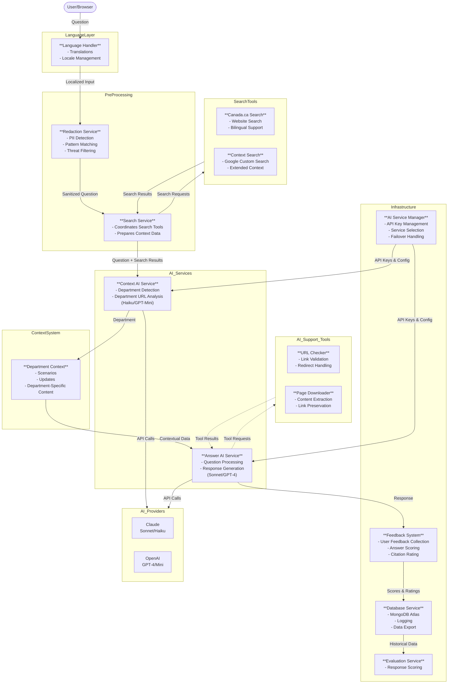

# React app for learning and ux research for gen AI applications

A React-based AI chat application that provides answers designed and sourced exclusively from and for Government of Canada websites. Built to assist users navigating Canada.ca and other government services.

This project was bootstrapped with [Create React App](https://github.com/facebook/create-react-app).

## Status - proof of concept - deployed on Vercel in French and English- contact Lisa for link 
- this is a proof of concept  - usability testing is underway
- Back-end MongoDB database to store conversation history and SME scores to use for evaluation (human and later AI)
- Evaluation input of csv files generated from user feedback questions to score AI responses
- Can choose either Claude Sonnet 3.7 or OpenAI GPT-4o API AI service for both shorter Context call (Haiku or Mini) and longer Answer call (Sonnet or GPT-4o)
- System prompts are built from sets of files, including agentic instructions for the AI service, and contextual scenarios and updates for the answer service pulled in for specific departments, based on the department selected byt the Context AI service 
- Admin page for access to chatlogs in JSON or CSV format, Batch page to submit csv files of questions for human evaluation, Evaluation page planned later to score AI chatlogs using the set of human-scored question/answer pairs

## Uses GC Design system for some components, others are html/css
-  https://design-system.alpha.canada.ca/

## 🌟 Key Features

### Tuned for Canada.ca user needs 
- AI response is tagged so sentences in answer can be displayed in accessible canada.ca format and citation urls can be displayed in a single url for next step of task, with clickable link available for clickthrough rate measurement
- assumes the AI service will be called from a specific canada.ca page, and uses the referral url to pass that information to the AI service. The referral url is either passed to the AI service from the chat interface  for testing purposes, or from the query tag on the call of the application. The query tag is the url of the page that AI Answers is called from - it must be encoded properly.
- system prompt forces short answers of a maximum of 4 sentences to improve clarity, use plain language, and reduce risk of hallucinations.
- scenarios address top user issues and general instructions for the AI service to use the context service, answer service and tools to answer the question and provide a citation url for all answers sourced from canada.ca or gc.ca sites. 
- uses canada.ca search to provide a set of search results to help the AI service derive the departmental context, and helps the AI answer service answer the question and provide a citation url 
- takes advantage of canada.ca interaction patterns and support - e.g. if a wizard is already in place, direct the user to answer those questions rather than having the AI service attempt to answer. AI services aren't optimized for layers of question logic and aren't effective for that purpose.  
- since pages are added and updated frequently, the AI answer service calls a tool to read the page if it identifies a new, updated or unfamiliar url (from the search results, the contextual scenario and update files, or the referral url)   
- PII is redacted programmatically in the code, no PII is sent to the AI service or logged into the database. When PII is detected in the user question, the user is alerted that the question will not be sent to the AI service to protect their privacy, and that they should ask the question without private personal details. 
- Threats,manipulation and obscenity redaction is also in place. Similar to PII, the user is alerted that the question will not be sent to the AI service, and that they should ask the question differently. Usability testing of this feature showed users were successful at understanding the instructions and asking the question without specific threat words. 

### Official languages support
- Matches canada.ca spec with EN and FR official translated versions of the main AI Answers page 
- Users can ask questions in any language on either page, but the citation url will be to an English canada.ca or gc.ca URL if the user is asking from the English AI Answers page, and to a French citation url if the user is asking from the French AI Answers page. 
- Language selector also available in batch process
- Context service loads Canada.ca French menu structure and FR department and agency names and urls
- System prompt scenarios and updates all include English and French citation urls pairs when a scenario or example suggests a specific url be used for related questions
- All text displayed to users in JSON language files for easy updates and translations -  view the [fr.json file](src/locales/fr.json).

### Multi-model design - independent of AI service provider
- Multiple AI service providers enables testing and exploration of strengths and weaknesses of different models
- Anthropic Claude Sonnet  and OpenAI GPT latest models are currently supported - Cohere was in progress but has been put on hold 
- Failover in place, to switch to the other AI service if one fails
- Prompt caching implemented to improve response quality and speed
- Confidence rating system for citation urls 
- Temperature set to 0 for more deterministic responses for both models
- Conversation history management - pass conversation history to AI service for context in 'message' field
- Enhanced citation handling - the AI calls a tool to check if the citation url is valid and if not
- System prompts optimized for 2024 model compatibility

### Evaluation-driven design to eventually achieve 100% answer accuracy
- Evaluation system to score AI responses and provide feedback for continuous improvement
- Evaluation input of csv files generated from user feedback questions to score AI responses
- Good source of learning about this methodology is: https://www.ycombinator.com/library/Lg-why-vertical-llm-agents-are-the-new-1-billion-saas-opportunities

### Accessibility features
- GCDS components - TODO should the input field have focus when page loads? TODO: some components couldn't get inputs to work so are temporarily replaced with plain html
- No streaming of responses - response is formatted and complete before it is displayed
- Get ideas from this accessibility AI application: https://adf-ask-accessibility-daeeafembaazdzfk.z01.azurefd.net/

## Microservices prompt-chaining architecture and Chain of Thought
- prompt-chaining architecture to improve response quality and speed [see diagram](#microservices-prompt-chaining-architecture-diagram)
- Chain of Thought - the answer service is designed to output a set of preliminary checks to help it derive an answer, for example it translates and outputs the user question in English if the question is in another langauge, gathers possible citation urls from urls it collects from the context service and system prompt scenarios and updates etc. 
References: 
* https://docs.anthropic.com/en/docs/build-with-claude/prompt-engineering/chain-prompt
* https://www.deeplearning.ai/the-batch/agentic-design-patterns-part-5-multi-agent-collaboration/

## Agentic tool use 
The application uses several specialized tools to enhance AI interactions:
1. Canada.ca Search Tool (`canadaCaSearch.js`) - called before the Context AI service to supply it with a set of search results 
   - Performs searches on Canada.ca websites
   - Supports both English and French queries
   - Returns top 3 search results with summaries and links
   - Uses Playwright for dynamic content loading

2. URL Status Checker (`checkURL.js`) - if needed, called by the AI answer service to check the citation url
   - Verifies if URLs are active and accessible
   - Handles redirects and HTTPS certificates
   - Used to validate citation URLs before including them in responses

3. Context Search Tool (`contextSearch.js`) - optionally called before the Context AI service to supply it with a set of search results 
   - Integrates with Google Custom Search API
   - Provides broader web search capabilities
   - Returns formatted results with titles, links, and summaries
   - Used for additional context gathering

4. Web Page Downloader (`downloadWebPage.js`) - if needed, called by the AI answer service to read a new, updated or unfamiliar page
   - Downloads and parses web page content
   - Preserves link structures and formatting
   - Focuses on extracting main content
   - Used to gather detailed information from citation URLs

These tools work together to ensure accurate information retrieval, URL validation, and content verification for AI responses.

#### 1. Context AI service 
The context service uses the user question, the selected language and the referral url if available to derive the department and department url from the [`department-structure.js`](src/services/systemPrompt/departments_EN.js) file for Canada.ca. The context service is run from the [`ContextSystem.js`](src/services/contextSystemPrompt.js) file which loads the department structure files and contains the instructions for the selected AI service on how to derive the context from the user question.

- The [`(src/services/contextService.js)`](src/services/contextService.js) is the first service to be called in the prompt-chaining architecture.
- The referring URL input field in the Options expand/collapse section of the chat interface is a temporary testing phase solution because there are no AI buttons on any live web pages that can pass a url parameter yet.  Referring url can also be passed from the query tag on the call of the application.

- Context service uses a small light AI model (Anthropic Haiku or GPT-4o Mini) to evaluate the question to determine the department most likely to have content related to the question - it uses the department and agency list of names and urls (pulled from Canada.ca) to get the full name, abbreviation and url.
Output: department and department url if found

#### 2. Answer service
Input: user message with department context from context service, search results, and referral url (from referral url input field or from query tag on the call of the application). Uses selected AI service.
Output: answer and citation url if provided (no citation url if the user question is not about Government of Canada services)
Loading department-specific context:  
- The scenarios-all.js file is always loaded - it contains the general scenarios that apply to all departments.
- The department-specific scenarios and updates files are loaded if they exist for the department selected by the context service - they contain scenarios and examples created and managed by the department. They are located in context folders in the [`src/services/systemPrompt/`](src/services/systemPrompt/) folder. 
- This ensures we always have the general scenarios as a base, with department-specific scenarios added when available.

#### 3. AI service manager
Manage API keys, endpoints and batches for each AI service

#### 4. Feedback manager
If user feedback is provided, (eg. user clicks Good or Needs Improvement) a score is generated for the AI response and stored in the database.  For 'Needs Improvement', each sentence of the AI response is scored separately (checkboxes appear for the correct number of sentences), and the citation is assigned a score as well. A total score is generated by averaging the scores of the sentences, weighted to 75% and the citation score to 25%. 

#### 5. Database service
Log all interactions to database 
Output:logs of every interaction, with all data for that conversation including feedback scores, associated with a chat ID 

#### 6. TODO Evaluation service
Input: questions and correct citation and answers from evaluation  file
Output: answers and citations from current system and selected model and model version - send to scoring AI service 
References: https://platform.openai.com/docs/guides/evals and https://github.com/anthropics/evals and https://www.giskard.ai/glossary/llm-evaluation

### Privacy Protection
- PII (Personally Identifiable Information) safeguards:
  - Basic redaction for name patterns in English and French - uses same algorithm from [feedback tool](https://github.com/alpha-canada-ca/feedback-viewer/blob/master/src/main/java/ca/gc/tbs/service/ContentService.java)
  - Pattern detection for numbers like phone numbers, SIN or account numbers, and email/mailing addresses also uses the feedback tool algorithm 
- All redaction happens in our code - no PII or threats, manipulation or obscenity gets logged into the database and no PII is sent to an AI service
- User is warned that the question will not be sent to the AI service to protect their privacy if it contains PII  - appropriate messages are displayed to the user

### Content Filtering and redaction
Blocks four categories of inappropriate content:
- Strong profanity and explicit vulgarities
- Discriminatory slurs (racial, ethnic, homophobic, etc.)
- Sexual insults and explicit vulgarities
- Compound offensive terms and phrases
 - User is warned that the question will not be sent to the AI service because it contains inappropriate words, they are asked to try asking the question differently

### Guardrails for security
- Manipulative words and phrases are redacted and the user is warned that the question was not sent to the AI service 
- Character limit (750) to prevent prompt injection and overuse - this is not a general AI service but rather an aid for users having trouble deriving the answer for their situation on Canada.ca and other gc.ca sites
- Rate limiting: 3 questions per session to both prevent manipulation and overuse
- Ideas here: https://www.guardrailsai.com/ and https://github.com/guardrails-ai/guardrails

### Data Management
- MongoDB Atlas Cloud integration
- Structured database schema for conversations in models/chat/interaction.js
- ChatAppContainer → LoggingService → API endpoint → Schema for logging user interactions
- Chat-logs API endpoint to retrieve logs from the database 
- External database entry viewer
- CSV/JSON export capabilities for:
  - User feedback
  - Evaluation data
  - Tagged response sentences

### User Interface - a series of usability tests have been identifying and resolving UX issues as we go
- Feedback collection system
  - Feedback suppression for clarifying questions
  - Structured response collection
- User survey integration via Qualtrics
- AI service selector
- Referring URL tracking
- Expandable options menu

## 📝 Contributing
TODO:contributing guidelines and code of conduct for details on how to participate in this project.

## Microservices and AI tools architecture diagram

