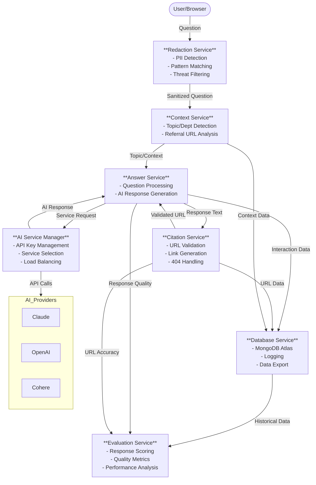

# React app for learning and ux research for gen AI applications

A React-based AI chat application that provides answers designed and sourced exclusively from and for Government of Canada websites. Built to assist users navigating Canada.ca and other government services.

This project was bootstrapped with [Create React App](https://github.com/facebook/create-react-app).

## Status - proof of concept prototype - deployed on Vercel - contact me for link 
- this is a proof of concept prototype for research purposes only
- Back-end MongoDB database to store user questions and answers and expert feedback
- Evaluation input of csv files generated from user feedback questions to score AI responses
- Can choose either Claude Sonnet 3.5, 🇨🇦 Cohere command-r-plus-08-2024 (not yet on production), or OpenAI GPT-4o API AI service
- System prompt includes menu structure, updated CRA account context, and specific instructions for top task examples 

## Uses GC Design system (but not fully integrated) - couldn't get inputs to work for url field, radio buttons or checkboxes
-  https://design-system.alpha.canada.ca/

## 🌟 Key Features

### Tuned for Canada.ca user needs 
- ai response is tagged so sentences in answer can be displayed in accessible canada.ca format and citation urls can be displayed in a single url for next step of task with clickable link available for clickthrough rate measurement
- system prompt forces short answers of a maximum of 4 sentences to improve clarity, use plain language, and reduce risk of hallucinations
- scenarios address top user questions on canada.ca 
- takes advantage of canada.ca interaction patterns and support - e.g. if a wizard is already in place, direct the user to answer those questions rather than attempting to walk them through the process in the ai service. AI services aren't optimized for question logic and aren't effective for that purpose.  
- evaluation system and logging for continuous improvement as models evolve and both users and teams experiment with the ai application

### Official languages support
- Bilingual system prompts (English/French) - loads based on selected language to improve response quality and reduce input token load
- Language selector available in evaluation process
- loads Canada.ca French menu structure and navigation options
- Full French version of application with official translation
- All text displayed to users in JSON language files for easy updates and translations -  view the [fr.json file](src/locales/fr.json).

### Multi-model design - independent of AI service provider
- Multiple AI service providers enables testing and exploration of strengths and weaknesses of different models
- Anthropic Claude Sonnet  and OpenAI GPT are currently supported - Cohere is in progress - should explore Mistral to see if it performs better for French - all of these models are available through [Amazon Bedrock](https://aws.amazon.com/bedrock/?sec=aiapps&pos=2)
- Failover to other AI service if one fails
- Prompt caching implemented to improve response quality and speed
  - Claude: Using `anthropic-beta: prompt-caching-2024-07-31`
  - GPT: Automatic caching
- Confidence rating system for citation urls 
- Temperature set to 0.5 for more deterministic responses for both models, but still allows for some variation to improve response quality
- Conversation history management - pass conversation history to AI service for context in 'message' field
- Enhanced citation handling - 404 errors for canada.ca urls are replaced by link to canada.ca search page
- System prompts optimized for 2024 model compatibility

### Evaluation-driven design to eventually achieve 100% answer accuracy
- Evaluation system to score AI responses and provide feedback for continuous improvement
- Evaluation input of csv files generated from user feedback questions to score AI responses
- Good source of learning about this methodology is: https://www.ycombinator.com/library/Lg-why-vertical-llm-agents-are-the-new-1-billion-saas-opportunities

### Accessibility features
- GCDS components - TODO should the input field have focus when page loads? TODO: some components couldn't get inputs to work so are temporarily replaced with plain html
- No streaming of responses - response is formatted and complete before it is displayed
- Get ideas from this accessibility AI application: https://adf-ask-accessibility-daeeafembaazdzfk.z01.azurefd.net/

## Microservices prompt-chaining architecture
- TODO - implement microservices prompt-chaining architecture to improve response quality and speed [see diagram](#microservices-prompt-chaining-architecture-diagram)
References: 
* https://docs.anthropic.com/en/docs/build-with-claude/prompt-engineering/chain-prompt
* https://www.deeplearning.ai/the-batch/agentic-design-patterns-part-5-multi-agent-collaboration/

#### 1. Context service 
The context service uses the user question, the selected language and the referral url if available, to derive the topic and topic url from the [`menu-structure.js`](src/services/systemPrompt/menuStructure_EN.js) files for Canada.ca, and the department and department url from the [`department-structure.js`](src/services/systemPrompt/departments_EN.js) file for Canada.ca. The context service is run from the [`ContextSystem.js`](src/services/contextSystemPrompt.js) file which loads the department and menu structure files and contains the instructions for the selected AI service on how to derive the context from the user question.
- The [`(src/services/contextService.js)`](src/services/contextService.js) is the first service to be called in the prompt-chaining architecture.
- The referring URL input field in the Options expand/collapse section of the chat interface is a temporary testing phase solution because there are no AI buttons on any live web pages that can pass a url parameter yet.  

-Context service uses a small light AI model (Anthropic Haiku) to evaluate the question to determine the topic and department area of the question. Then that microservice passes everyting it found, including the topic and department urls to the answer service.
Output: topic and topic url if found, department and department url if found

#### 2. Answer service
Input: user message with topic and department context from context service and referral url (from referral url input field or from query tag on the call of the application). Uses selected AI service.
Output: answer and citation url if provided (no citation url if the user question is not about Government of Canada services)
Loading department-specific context:  
- The scenarios-all.js file is always loaded - it contains the general scenarios that apply to all departments.
- The department-specific scenarios and updates files are loaded if they exist - they contain scenarios and examples created and managed by the department. They are located in context folders in the [`src/services/systemPrompt/`](src/services/systemPrompt/) folder. For example, the CRA scenarios are at [`src/services/systemPrompt/context-cra/cra-scenarios.js`](src/services/systemPrompt/context-cra/cra-scenarios.js).
- This ensures we always have the general scenarios as a base, with department-specific scenarios added when available.
- ContextSystemPrompt and base.js system prompt handle the risks of using referral url  (e.g. they're on the CRA account page but they asked about EI claims) or relevant to the question (e.g. they're on the CRA account page but they asked about IRCC passport services).

#### 3. AI service manager
Manage API keys, endpoints and batches for each AI service

#### 4. Citation service
Input: context from context service, question, and answer from answer service
-Feed input to AI with base systemp prompt citation selection criteria, and use context to load hierarchical sitemap, or menu structure and any update files. 
Or use search api and select first search result url as citation

Output: single citation url 
- Extensive citation instructions to reduce hallucinations and improve accuracy
- Citation link validation (404 checking)
- URL validation and sanitization
- TODO - replace with search function

#### 5. Database service
Log all interactions to database - eventually need department filter? 
Input: referring url (if provided), TODO: add context from context service, userquestion, answer, AI service selected TODO: addAI service used,citation-original and citation-used (from citation service), user-feedback items, confidence ratings for citation url, TODO:add token counts, TODO: add evaluation data?
Output:logs and evaluation data?

#### 6. Evaluation service
Input: questions and correct citation and answers from evaluation  file
Output: answers and citations from current system and selected model and model version - send to scoring AI service 
References: https://platform.openai.com/docs/guides/evals and https://github.com/anthropics/evals and https://www.giskard.ai/glossary/llm-evaluation

### Privacy Protection
- PII (Personally Identifiable Information) safeguards:
  - Basic redaction for name patterns in English and French - TODO apply better algorithm from [feedback tool](https://github.com/alpha-canada-ca/feedback-viewer/blob/master/src/main/java/ca/gc/tbs/service/ContentService.java)
  - Pattern detection for unformatted numbers like phone numbers account numbers, addresses that will also use the feedback tool algoright - right now it's very basic
  - Anonymous data storage
 - all the redaction happens in our code - no PII gets logged into the database and no PII is sent to an AI service(the system prompt tells the AI why it might see the letters XXX in the user question)
- Conversation history management with privacy controls

### Guardrails for security
- Profanity and threat word filtering - displays warning to user and doesn't log or send to AI service 
- TODO: messages with redacted threat words and obscenities are NEVER stored, so we’ll have no analytics to show it’s happening. That’s maybe not good. We might want to store the redacted versions in the database, without ever sending them to the AI service, just to track that kind of activity
- Character limit (750) to prevent prompt injection
- Rate limiting: 3 questions per session
- threat filtering in system prompt to prevent use of languages other than English or French - TODO - improve this
- Ideas here: https://www.guardrailsai.com/ and https://github.com/guardrails-ai/guardrails

### Data Management
- MongoDB Atlas Cloud integration
- Structured database schema for conversations in models/chat/interaction.js
- ChatAppContainer → LoggingService → API endpoint → Schema for logging user interactions
- Chat-logs API endpoint to retrieve logs from the database 
- External database entry viewer
- CSV/JSON export capabilities for:
  - User feedback
  - Evaluation data
  - Tagged response sentences

### User Interface
- GCDS (Government of Canada Design System) compliance
- Feedback collection system
  - Feedback suppression for clarifying questions
  - Structured response collection
- User survey integration via Qualtrics
- AI service selector
- Referring URL tracking
- Expandable options menu

### Content Integration
- TODO: write up 'update' instructions for departments to add structured data for any new pages added since training - or removed since training
- TODO - add more canada.ca urls to the menu structure to load selectively to improve response quality in French - for example https://www.canada.ca/fr/agence-revenu.sitemap.xml with https://www.canada.ca/en/revenue-agency.sitemap.xml or even better, have the topic tree per theme

### Development
- Local development using Create React App
- Environment variables prefixed with `REACT_APP_` for local development
- GitHub repo for version control will move to CDS repo soon

### Production
- Deployed on Vercel
- Environment variables configured without `REACT_APP_` prefix and stored in Vercel environment variables
- MongoDB Atlas for database - only writes to database from production
- deploys to Vercel from Github (any change to main triggers deploy)

## 📈 Evaluation & Testing
- UserFeel study 1 - October 2024 (4 participants EN/1 FR) - participants solve 
- UserFeel study 2 - November 2024 (8 participants EN)
- Evaluation process improvements:
  - Feedback file import capability
  - Response parsing optimization
  - Structured CSV/JSON output

## 📝 Contributing
TODO:contributing guidelines and code of conduct for details on how to participate in this project.

## Microservices prompt-chaining architecture diagram {#architecture-diagram}

